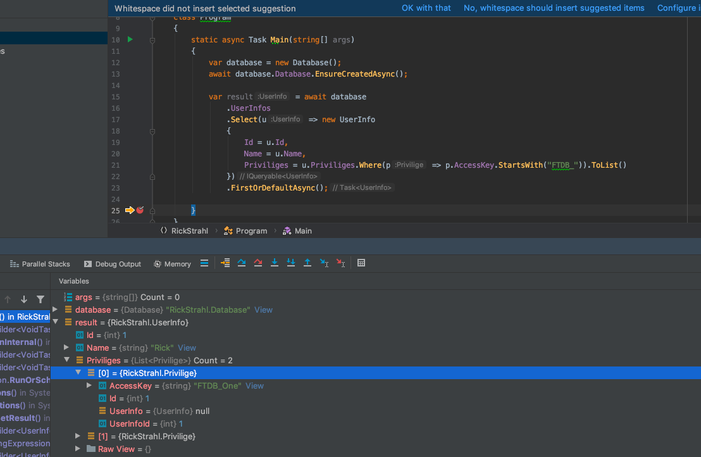

# Rick Strahl's Entity Framework Usecase

This allows you to filter a sub collection in Entity Framework
and still load the objects you need.

```c#
var result = await database
    .UserInfos
    .Select(u => new UserInfo
    {
        Id = u.Id,
        Name = u.Name,
        Priviliges = u.Priviliges.Where(p => p.AccessKey.StartsWith("FTDB_")).ToList()
    })
    .FirstOrDefaultAsync();
```

With the results of...



This project is using .NET Core 3 and EF Core 3 with SQL Server.